# Technical Document - Visibly
### Kasparro Agentic Commerce Hackathon | Track 5: AI Representation Optimizer

## What is Visibly

AI shopping assistants - ChatGPT, Perplexity, Google AI Mode, Shopify's own Shop AI - do not browse stores the way humans do. They read structured product data and make contextual decisions about what to recommend. If a listing has a vague description, no return policy, missing ingredients, or no certifications, the AI agent skips the product entirely. The merchant never sees an error. There is no "AI Search Console" equivalent. They are flying blind.

Visibly is the diagnostic and fix layer for this problem. It connects directly to a Shopify store, audits every product against category-specific AI readiness rubrics, surfaces exactly what is causing each product to be skipped, generates LLM-powered improvements for every gap, and applies those improvements directly to the live store in one click via the Shopify Admin API.

The result is a measurable, trackable increase in AI citation probability - the likelihood that an AI shopping agent will recommend a product when a relevant buyer query is made.

**Why now:** Shopify has Shop AI. Google has AI Overviews. Amazon uses LLMs for product discovery. Every one of these systems penalises incomplete product data. Unlike traditional search, there are no ranking signals merchants can inspect. Traditional SEO tools measure keyword density and backlinks - none of that is what an LLM reasons about. Visibly simulates the actual AI decision process, works backwards from failures, and closes the loop by writing fixes directly back to the store.

---

## Data Flow Pipeline

```text
Merchant Browser
  → React Frontend (Vite · React Router v6)
  → Express Backend (Node.js · requireAuth middleware)
  → resolveAccessToken() - OAuth exchange + direct token fallback
  → fetchShopifyProducts() - live fetch, limit 250
  → normalizeProduct() - field name mismatch resolved, tags normalised
  → detectCategory() [DET] - 9 categories, confidence scoring
  → scoreProduct() + applyCompletenessDeductions() [DET]
  → scoreToAICitationProbability() [DET] - non-linear curve, cap 91%
  → Step 1: Persona Extraction [LLM]
  → Step 2: Batched Query Generation + Simulation [LLM]
  → runQueryWithConsensus() [DET] - majority vote, tiebreaker on split
  → Step 3: Fairness Check [LLM] - validates correct vs incorrect exclusions
  → detectIssues() [DET] - shim wrapping scoreProduct(), zero LLM cost
  → Step 4: Fix Recommendations [LLM] - incorrect exclusions only
  → deduplicateFixes() [DET] - field-level conflict resolution
  → Counterfactual Engine - apply fix · re-simulate · delta score returned
  → SQLite DB log (score_snapshots · optimization_history · product_sales)
  → Audit Result + Citation Probability returned to client
```

**[DET]** = deterministic code. **[LLM]** = OpenAI API call. Every boundary between the two is intentional - see the Architecture section for rationale.

---

## System Architecture



Visibly is a full-stack SaaS application: React SPA (Vite, React Router v6) backed by a Node.js/Express server and an SQLite database (`better-sqlite3`, WAL mode).

### State and Storage

The system uses SQLite with WAL mode for immediate, reliable local writes. Three tables:

- `score_snapshots` - daily historical records of product AI scores, enabling trend tracking over time
- `product_sales` - 30-day revenue and order counts per product, used for sales vs score correlation
- `optimization_history` - an immutable ledger of every applied or reverted product change, tracking `score_before`, `score_after`, `fields_changed`, and `old_values` for full rollback

### Authentication and Sessions

Merchants enter their Shopify Client ID and Client Secret directly in the web UI. Credentials are stored only in `express-session` - in memory for the duration of the browser session, never written to disk or `.env`. A `requireAuth` middleware guards every store-specific endpoint, reading credentials from `req.session.store`. This ensures strict data isolation between merchants without requiring a user database.

### File Structure and Module Isolation

Each module is isolated by responsibility:

- `server.js` - route definitions, session management, Shopify write operations
- `categoryEngine.js` - scoring, category detection, citation probability, the sole source of truth for product quality assessment
- `shopifyDataService.js` - all Shopify read operations and snapshot persistence
- `counterfactual.js` - fix simulation and delta prediction, isolated so it can be tested independently
- `detect-issues.js` - compatibility shim, wraps `scoreProduct()` for legacy call sites
- `analyticsRoutes.js` - analytics endpoints separated from core audit routes to keep server.js readable

This separation means category scoring logic is never mixed with route handling, and the LLM call chain is never entangled with data persistence.

---

## Architectural Boundary: AI vs. Deterministic Code

This is the most important design decision in the system.

**LLM handles tasks that require reasoning about context, intent, and meaning:**
- Persona extraction - inferring buyer type and sophistication from product and pricing signals across the full catalogue
- Query generation - producing searches that reflect how a specific buyer type actually phrases requests to an AI shopping agent
- Shopping simulation - deciding whether a product satisfies a buyer query the way a real AI agent would
- Fix generation - writing specific, contextually appropriate improvement suggestions per product and category

**Deterministic code handles tasks that are pattern checks on structured data:**
- Category detection - keyword and regex matching on product fields
- Rubric scoring - weighted criteria evaluation against normalised product data
- Completeness deductions - threshold checks on word count, tag count, image count, price
- Citation probability curve - pure mathematical transformation, no inference needed
- Issue detection - binary field presence checks, zero LLM cost
- Fix deduplication - field-level grouping and conflict resolution
- Priority assignment - threshold comparison on inclusion rates
- HTML stripping - regex, not interpretation

**Why this boundary matters:** Using an LLM for binary string checks wastes tokens, adds 1–2 seconds of latency per call, and introduces non-determinism - the same product might get different issues flagged on different runs. We run 6 deterministic checks in under 1ms with zero API cost. The LLM is reserved exclusively for tasks that actually require reasoning.

---

## End-to-End Merchant Journey

This section documents the product experience from first visit to first verified improvement.

### Step 1 - Connect screen

The merchant enters their store URL, Client ID, and Client Secret. The system immediately verifies the connection, checks API scopes, and shows a plain-English error if anything is wrong:
- Missing `read_products` → blocked with explanation
- Missing `write_products` → non-blocking amber warning, read-only mode permitted
- Invalid credentials → specific message distinguishing wrong URL from wrong token

A "How to get your credentials" accordion walks through the exact Shopify Admin steps. Credentials are never transmitted beyond the session - this is explained in the UI with a lock icon.

On success, a background sync immediately fetches all products, scores them, and saves the first snapshot. The merchant lands on the dashboard within seconds.

### Step 2 - Overview dashboard

The dashboard shows an AI Visibility Score ring (store average), total products, products optimised, issues found, and estimated revenue impact. Below this, two panels:

- **Issues Breakdown** - each issue type ranked by severity with product count and a Critical/Warning label
- **Critical Products** - the lowest-scoring products with "Fix now" buttons that deep-link directly to the Optimize tab with that product pre-selected

The design deliberately shows citation probability alongside the numeric score. A score of 34/100 is abstract. "12% - Almost never cited" creates urgency. This framing is a product decision, not just a display choice.

### Step 3 - Products tab

All products in a sortable table with category badges, AI score (as a coloured progress bar), issue count, status badge (Critical / Needs Work / Optimised), and an Optimize action. A search bar and filter tabs (All / Critical / Needs Work / Optimised) let merchants triage their catalogue quickly.

Category badges are colour-coded and clickable - merchants can correct auto-detected categories, which immediately re-scores the product using the correct rubric.

### Step 4 - Optimize tab

The core product screen. For a selected product:

- A score improvement card shows Current Score → Projected Score with the delta
- Citation probability shows before and after with a human label ("Almost never cited" → "Likely to be cited")
- A side-by-side panel shows Current Listing vs AI-Optimised Version for every field
- Each issue is labelled with its specific rubric criterion, severity, and how many points fixing it recovers
- A "See full rubric" link opens a modal showing the complete scoring breakdown for that category

The predicted improvement uses a 0.85 realism discount and is capped at 85/100 score and 91% citation probability. This is intentional - showing 100% would destroy merchant trust. The projection is framed as a realistic estimate, not a guarantee.

### Step 5 - One-click apply

When the merchant clicks "Apply to Store":

1. A confirmation modal shows exactly what will change - description, tags, return policy, metafields - before anything goes live
2. A step-by-step progress indicator shows each change being applied in real time
3. The product is immediately re-fetched from Shopify and re-scored
4. The UI transitions from predicted estimate to verified, empirical score
5. A success card shows the real before/after improvement with a "View in Shopify" link

Every applied change is logged to `optimization_history`. The "Undo" button in the History tab writes the original values back to Shopify via `POST /api/products/revert` and logs the reversion. Nothing is ever unrecoverable.

### Step 6 - Analytics tab

Three sub-screens merchants return to over time:

- **AI Traffic** - full catalogue ranked by visibility tier with revenue alongside score, showing the financial cost of low-visibility products
- **Score Trends** - line chart of score over time, store average and per-product, with "Optimised" annotations on the line where changes were applied
- **Sales Correlation** - scatter plot of revenue vs AI score with a linear regression trend line, proving in the merchant's own data whether better listings correlate with more sales

This is the retention layer. The first audit creates urgency. The analytics tab creates a reason to come back every week.

---

## Key Subsystems

### 1. Category-Aware Scoring (`categoryEngine.js`)

**Auto-detection:** Products are classified into one of 9 categories - `health_food`, `apparel`, `electronics`, `sports_equipment`, `beauty_skincare`, `home_living`, `food_beverage`, `baby_kids`, `general` - by scoring keyword and regex matches across `product_type`, `tags`, `title`, and `body`. A confidence level (high / medium / low) is returned alongside the category.

**Deep rubric validation:** Each category has its own weighted rubric. High-value criteria (15–25 points) require depth, not just keyword presence:

- Apparel fabric check requires a `%` match (e.g. `100% cotton`) or two distinct material keywords - not just the word "fabric"
- Electronics specs require at least two numeric values paired with units (e.g. `5000mAh`, `65W`) - not just the word "specs"
- Sports equipment dimensions require a numeric measurement with units (`cm|mm|inch|lbs|kg`) - not just the word "dimensions"
- Health food ingredients require at least three specific ingredient names - not just the word "ingredients"

This prevents gaming. A one-word mention of "ingredients" on a protein bar listing earns zero points.

**Trust signals and social proof:** The rubric explicitly scores review count and rating signals where available. Weak social proof (fewer than 3 reviews) is flagged as a low-severity issue. This directly addresses the track's requirement for "weak trust signals" to be identified.

**FAQ and policy coverage:** Return policy and shipping information are scored as distinct high-value criteria (10–20 points depending on category) across every rubric. Products missing these fields are flagged as Critical regardless of how strong their descriptions are, because AI agents weight policy completeness heavily for buyer trust queries.

**Normalisation:** `normalizeProduct()` resolves the field name mismatch between raw Shopify format (`body_html`, comma-separated string tags) and the internal mapped format (`description`, tag arrays). Without this, every rubric check returned undefined and products scored near zero - this was a critical silent bug.

**Completeness deductions:** After rubric scoring, `applyCompletenessDeductions()` subtracts points for structural deficits: descriptions under 30 words (−20), zero tags (−10), single image (−8), title under 3 words (−5), zero or placeholder price (−10).

**Score ceiling:** `Math.min(92, score)` is applied as the final step. No product can ever score 100/100. This is a deliberate product decision - no listing is ever truly complete from an AI agent's perspective, and a perfect score would mislead merchants into stopping optimisation.

### 2. AI Citation Probability

Raw 0–100 scores are converted to citation probability via a non-linear curve in `scoreToAICitationProbability()`. The curve is deliberately non-linear: small improvements at the bottom of the scale matter less than improvements in the 50–80 range, where most AI citation decisions are actually made.

Five tiers with human labels:
- ≥80% - "Very likely to be cited"
- 55–79% - "Likely to be cited"
- 30–54% - "Unlikely to be cited"
- 10–29% - "Rarely cited by AI"
- <10% - "Almost never cited"

**Prediction vs measurement:** When showing projected improvement before a fix is applied, a 0.85 realism factor is applied to projected gains and the result is capped at 85 score / 91% probability. Once a fix is applied and the product is re-fetched and re-scored from Shopify, the actual measured citation probability is shown with no cap - it reflects empirical truth, not a prediction.

**Why the cap exists:** Showing 100% citation probability would be misleading and would destroy merchant trust when the product is still skipped for some queries. The 91% ceiling is a trust decision, not a technical constraint.

### 3. Counterfactual Engine

Before a fix is applied, the counterfactual engine takes the proposed improved product, runs it through the same AI query simulation pipeline as the original, and returns a delta: the difference between the original inclusion rate and the projected post-fix inclusion rate.

This is the difference between a recommendation tool and a proof tool. "We think this will help" is not the same as "we simulated this and here is the predicted outcome." Merchants see the exact queries the improved product is predicted to pass, not a generic confidence score.

### 4. One-Click Apply and Write Pipeline

- `PUT /api/products/apply-optimization` - writes description, tags, title, and metafields (return policy, shipping information) directly to Shopify Admin API
- Confirmation modal required before any write - no changes go live without explicit merchant review
- Product is re-fetched from Shopify and re-scored immediately after apply - the UI shows the real measured improvement, not the prediction
- `POST /api/products/revert` - writes original field values back to Shopify and logs the reversion in `optimization_history`
- Shopify `429 Too Many Requests` handled with automatic retry on `Retry-After` header value
- `write_products` scope verified on connect - missing scope shows non-blocking amber warning, full read-only mode still available

### 5. Analytics Pipeline

Powered by Recharts, combining SQLite records with live Shopify data:

- **AI Traffic Report** - products ranked by visibility tier (High ≥70, Moderate 40–69, At Risk <40) with revenue alongside each score, making the financial cost of low visibility explicit
- **Score Trends** - daily snapshots via a background cron job running every 60 minutes; line charts show store average and per-product trends with "Optimised" annotations where changes were applied
- **Sales vs Score Correlation** - scatter plot of revenue vs AI score across the full catalogue with a linear regression trend line computed in JavaScript. This is the most commercially important screen - it answers "does fixing my AI score actually make me more money?" using the merchant's own store data

---

## Implementation Details and Failure Handling

### Batched Query Generation

The original design called for 7 separate API calls per product - one per query. This was replaced with a single batched call that generates all 7 queries and runs all simulations in one prompt. For a 12-product store this reduces OpenAI calls from 84 to 12. The output shape is identical so nothing downstream changed.

### Simulation Consensus

`runQueryWithConsensus()` runs each simulation twice in parallel. If both agree, the result is returned with confidence averaged. If they disagree, a third tiebreaker call runs. A `consensus: false` flag is returned when the tiebreaker was needed, surfacing lower confidence to the merchant. Temperature is set to 0.2 to reduce but not eliminate variance - zero temperature makes the model overconfident.

### Centralised Variable Substitution

`buildPrompt(template, variables)` replaces all `{{variable}}` placeholders before any prompt is sent to OpenAI. `validateVariables()` runs before every build and intercepts null or empty variables before they reach the model. This prevents silent garbage output - the original implementation was sending literal `{{use_cases}}` placeholders to OpenAI, which the model treated as content and returned queries like "best product for {{use_cases}}."

### Auto Token Refresh

Shopify access tokens from the client credentials grant expire every 24 hours. The token manager caches the current token in memory with its expiry time and automatically fetches a fresh one if the token is within 5 minutes of expiry. This means the system works indefinitely without manual intervention.

### Shopify API Failures

`fetchProducts()` catches 401 Unauthorized and surfaces: "Invalid or expired Shopify token." It catches 404 and surfaces: "Store not found - check your store URL." Network failures are caught generically. The audit endpoint returns a structured error response rather than crashing.

### LLM Response Parsing Failures

Every OpenAI call is wrapped in try/catch. If JSON parsing fails, the call retries once. If the retry also fails, a conservative fallback is returned: `{ would_include: false, confidence: 0, reason: "parse_error", error: true }`. A single malformed LLM response does not crash the audit - it produces a conservative score for that query and the audit continues.

### Conflicting Fix Recommendations

`deduplicateFixes()` groups fixes by field, merges duplicates, keeps the highest impact estimate, and adds a `merged: true` flag. This is a second layer of protection - the Step 4 prompt also instructs the model never to return two fixes for the same field, but the post-processor catches any that slip through.

### Missing or Incomplete Store Data

If a store has zero products, the system fails fast before consuming any API credits: "No products found in this store." If a product has no description at all, it is flagged as `data-incomplete` and skipped by the simulation rather than producing a misleading 0% score. Empty state UIs throughout the frontend show specific, actionable messages - never a blank screen or a generic error.

---

## Commercial Model and Business Relevance

Visibly is designed around a freemium model that mirrors how Shopify merchants think about tools:

- **Free tier** - up to 25 products, AI scoring, issue detection, 5 AI optimisations per month, no one-click apply
- **Growth (₹2,999/month)** - up to 200 products, one-click apply, analytics and score trends, unlimited optimisations
- **Scale (₹7,999/month)** - unlimited products, competitor benchmarking, API access, custom rubrics, priority support

The free tier is designed to create urgency, not just provide value. A merchant who sees "12% citation probability - almost never cited" on their best-selling product and cannot apply the fix without upgrading will convert. The upgrade is framed as removing friction, not unlocking a feature.

The analytics tab is the retention driver. A merchant who can see their citation probability improving week over week, correlated with actual revenue data from their own store, has a reason to stay subscribed indefinitely. This is the "AI Search Console" model - always-on monitoring, not one-shot auditing.

---

## Known Limitations and Future Improvements

**No pagination above 250 products.** The current Shopify fetch uses `limit=250`. Stores with larger catalogues require cursor-based pagination using Shopify's `page_info` parameter. This is a one-function change and the highest-priority technical debt.

**Persona accuracy on mixed-category stores.** A store selling both industrial tools and baby clothes will produce a confused persona. The correct solution is per-category persona extraction with the store-level audit split by detected category. This is a clear v2 architectural change.

**Single-node SQLite architecture.** `better-sqlite3` in WAL mode handles concurrent reads well, but the database is tightly coupled to a single application instance. Horizontal scaling across multiple server nodes requires migrating to PostgreSQL or MySQL.

**The 91% citation probability cap is a product judgment, not an empirically validated threshold.** We do not have data proving that 92% is genuinely unreachable for any product. The cap exists to maintain merchant trust and prevent misleading projections. If real-world calibration data were available, the curve and ceiling should be adjusted to reflect actual AI agent behaviour.

**Image quality is not evaluated.** Product image resolution, background quality, and alt-text completeness are factors some AI agents consider. This would require vision model calls (GPT-4o with vision) and significantly increases cost. Most current AI shopping agents evaluate text data primarily - this is a v2 addition.

---

## What We Learned

**Simulation reveals what analytics cannot.** We initially assumed that low AI inclusion rates were always a product data problem - merchants had weak descriptions, missing policies, vague titles. Building the fairness checker taught us this was wrong. Roughly 40% of low-scoring products in our test audits were correctly excluded - the product genuinely did not fit the query for that buyer. This changed our core metric from "inclusion rate" to "actionable improvement rate." A tool that tells a merchant to fix things that do not need fixing destroys trust faster than a tool that finds nothing. The fairness checker is the most important feature in the system precisely because it makes the tool honest.

**Raw scores do not drive action. Probability does.** During development, we noticed that a score of "65/100" did not create the same urgency as "AI Citation Probability: 42% - Unlikely to be cited." Merchants understand probability intuitively because it directly answers the question they actually have: "Will AI agents recommend my product?" The reframing from score to probability is a product insight, not a cosmetic change.

**Friction kills optimisation loops.** Giving a merchant a perfectly AI-written product description is only half the value. If they must copy it, open a new tab, log into Shopify, find the product, paste it, and save it - they will not do it consistently. Building one-click apply via the Shopify Admin API removed the final friction point between analysis and action. This transformed the tool from a passive reporting dashboard into an active growth engine. The confirmation modal and revert system were prerequisites for shipping this - merchants needed a safety net before they would trust a tool to modify their live store.

**Category specificity is what separates a real product from a generic scanner.** Generic feedback ("add more description") teaches merchants nothing. Telling a protein bar merchant "you are missing macros (−15 pts) and allergen info (−15 pts) - these are the top two queries your product fails" teaches them exactly what to fix and why. The category-aware rubric system is what makes Visibly's recommendations feel like expert advice rather than automated checklists.

---

## What We Would Build Next

**Competitor benchmarking.** Compare a merchant's category scores against anonymised averages from other connected stores on Visibly. "Your protein bar is in the bottom 30% of health food stores" creates competitive urgency that internal scoring cannot.

**Real AI agent benchmarking.** Instead of simulating with our own prompt, actually query ChatGPT, Perplexity, and Google AI Overview with real buyer queries and record whether the merchant's products appear. Compare our simulation predictions against real-world results to calibrate accuracy and close the external validation gap.

**Shopify embedded app with continuous monitoring.** Turn Visibly into an embedded Shopify app with webhook listeners for `products/update` events, triggering targeted re-audits automatically. This is the "AI Search Console" vision - always-on, not one-shot. Merchants should not need to manually connect and rescan.

**Per-category persona extraction.** Fix the mixed-category persona problem by running separate persona extractions per detected product category before generating queries. A store selling both electronics and apparel should produce separate buyer personas for each vertical.

**Cursor-based pagination.** Implement Shopify's `page_info` pagination to support catalogues above 250 products. This is a one-function change with significant commercial impact - enterprise Shopify merchants often have thousands of products.